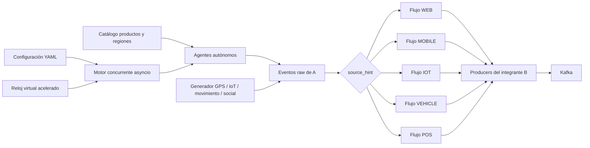
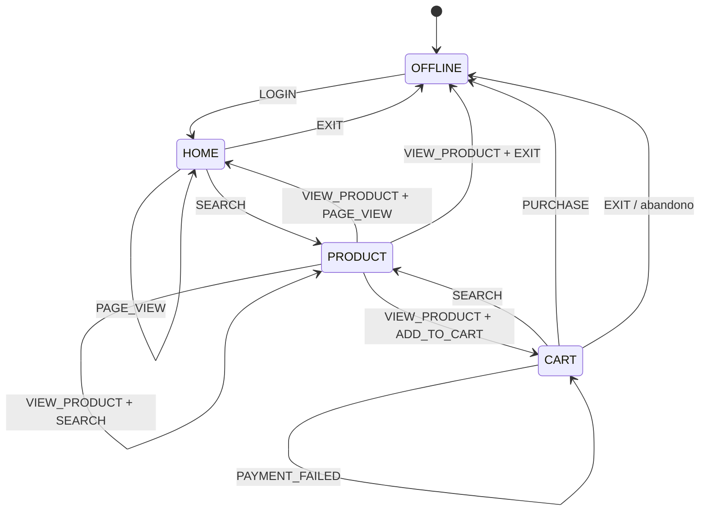

# Arquitectura y máquinas de estado — Parte A

## Flujo dentro de la plataforma

## Máquina de estados común

## Diferenciación de perfiles

| Perfil | Modificación principal |
|---|---|
| COMPRADOR_COMPULSIVO | Poco tiempo entre acciones, alta transición a carrito y compra |
| COMPARADOR | Muchas búsquedas y vistas, compra ocasional |
| COMPRADOR_NOCTURNO | Solo se activa en horas virtuales de 21:00 a 05:59 |
| CLIENTE_PREMIUM | Selecciona productos con precio alto y realiza compras de mayor valor |
| CLIENTE_FRECUENTE | Reinicia sesiones pronto y compra repetidamente |
| USUARIO_EXPLORADOR | Navega y busca, pero el peso de compra y carrito es cero |
| CLIENTE_INDECISO | Alta repetición de agregar y retirar del carrito |
| CLIENTE_ESTACIONAL | Baja intensidad en BASE y alta actividad en eventos empresariales |
